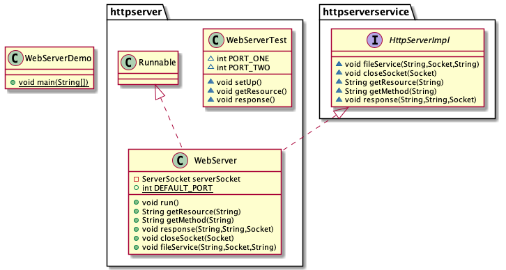

# WEB SERVER

- Create an http server using raw java socket. The http server would have 2 two or more endpoints which are,

1. '/' path: This endpoint should handle GET requests. Requests to this path should return a HTML content parsable by the browser

2. '/json' path: This endpoint should handle GET requests to the '/json' path and should return a JSON object recognized by the browser as a JSON object.

**The html page and json object returned should be read from the file system.**

Below is the uml class diagram for the task

